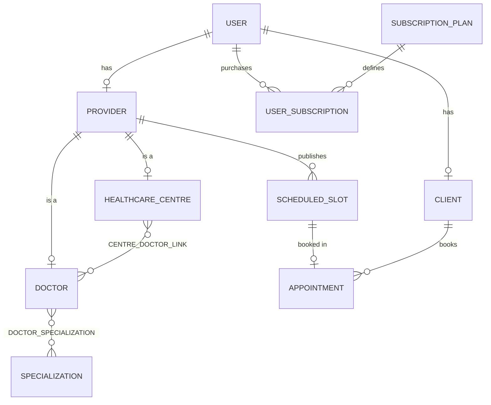

# MediLink Sri Lanka — Patient–Doctor Subscription Booking System

A production-grade, database-driven healthcare mediation web application built for the **Sri Lankan healthcare ecosystem**. Developed using **PHP 8.x**, **MySQL/MariaDB**, **PDO**, **HTML5**, **CSS3**, and **Bootstrap 5.3**, designed to run locally on **XAMPP**.

---

## 1. Project Overview & Business Model

MediLink Sri Lanka functions as a **subscription-gated mediator** connecting patients across Sri Lanka with verified Sri Lanka Medical Council (**SLMC**) registered doctors and Ministry of Health (**PHSRC**) certified Healthcare Centres.

### Core Business Rules & Clarifications
1. **Subscription-Gated Platform Access**:
   - Clients and Providers must maintain an active subscription to access premium features (booking slots, expanded GPS radius search, schedule publishing).
   - System Administrators bypass subscription restrictions.
2. **Explicit Separation of Medical Fees**:
   - **The platform does NOT process doctor consultation fees.**
   - Subscription fees in Sri Lankan Rupees (**LKR / Rs.**) cover technological mediator services: GPS radius discovery, appointment scheduling, and quota management.
   - Medical consultation charges and diagnostic treatments are paid directly by the patient to the doctor/hospital during the physical clinical consultation.
3. **Server-Enforced Monthly Quota**:
   - Each subscription tier grants a fixed monthly booking quota (e.g. 5, 15, or 30 bookings/month). Quotas are strictly enforced on the server within transactional boundaries.
4. **Haversine Geolocation Search**:
   - Proximity search dynamically calculates distances using the Haversine formula against pre-calibrated Sri Lankan coordinates and is clamped by the client's subscription tier.
5. **Race-Condition Safe Booking**:
   - Slot reservation utilizes MySQL ACID transactions with row-level locks (`SELECT ... FOR UPDATE`) to guarantee 100% prevention of concurrent double-booking.

---

## 2. Technology Stack & Prerequisites

- **Web Server**: Apache 2.4+ (via XAMPP)
- **Database**: MySQL 8.x / MariaDB 10.4+ (InnoDB engine)
- **Programming Language**: PHP 8.0, 8.1, 8.2, or 8.3
- **Database Driver**: PHP Data Objects (`PDO_MYSQL`) with Prepared Statements
- **Frontend**: HTML5, CSS3, JavaScript (ES6+), Bootstrap 5.3, Bootstrap Icons
- **Operating Environment**: Localhost (Windows XAMPP `C:\xampp\`)

---

## 3. Database Schema & Architecture

The database `patient_doctor_booking` adheres to strict **3NF Normalization** with foreign key constraints and composite junction tables:



### Relational Tables
1. **`USER`**: Central authentication, password hashing (`BCRYPT`), phone, and role (`CLIENT`, `PROVIDER`, `SYSTEM_ADMIN`).
2. **`CLIENT`**: Patient profile linked 1:1 with `USER`, DOB, gender, address, city, and GPS coordinates.
3. **`PROVIDER`**: Base provider entity linked 1:1 with `USER`, business name, type (`DOCTOR` vs `HEALTHCARE_CENTRE`), verification status, address, city, and coordinates.
4. **`DOCTOR`**: Specialised practitioner info linked 1:1 with `PROVIDER`, SLMC registration number, experience years, consultation duration, and biography.
5. **`HEALTHCARE_CENTRE`**: Institutional healthcare facility linked 1:1 with `PROVIDER`, PHSRC registration number, and facility overview.
6. **`CENTRE_DOCTOR_LINK`**: Junction table ($M:N$) linking Healthcare Centres with affiliated specialist doctors.
7. **`SPECIALIZATION`**: Master catalog of medical specialities (Cardiology, Dermatology, Pediatrics, Neurology, etc.).
8. **`DOCTOR_SPECIALIZATION`**: Junction table ($M:N$) associating doctors with one or more clinical specialties.
9. **`SUBSCRIPTION_PLAN`**: Tiered plans defining Price (LKR), duration, monthly quota, and search radius limit.
10. **`USER_SUBSCRIPTION`**: Historical membership logs with start/end dates, simulated payment references, and status (`ACTIVE`, `EXPIRED`, `CANCELLED`).
11. **`SCHEDULED_SLOT`**: Schedule availability records with date, start time, end time, and status (`AVAILABLE`, `BOOKED`, `BLOCKED`).
12. **`APPOINTMENT`**: Booked appointments with unique slot foreign keys, lifecycle statuses (`BOOKED`, `CONFIRMED`, `COMPLETED`, `CANCELLED`, `NO_SHOW`), and notes.

---

## 4. Installation & Local XAMPP Setup Guide

### Step 1: Start XAMPP Services
1. Open the **XAMPP Control Panel** (`C:\xampp\xampp-control.exe`).
2. Start the **Apache** and **MySQL** modules.

### Step 2: Import the Database
#### Option A: Via phpMyAdmin (Web UI)
1. Open your browser and navigate to: `http://localhost/phpmyadmin/`
2. Click **New** in the left sidebar and create a database named: `patient_doctor_booking`
3. Click the **Import** tab at the top.
4. Click **Choose File** and select `database/database.sql` from this project.
5. Click **Import** at the bottom of the page.

#### Option B: Via Command Line (Fast)
Open PowerShell or Command Prompt and run:
```bash
C:\xampp\mysql\bin\mysql.exe -u root -e "source c:/path/to/project/database/database.sql;"
```

### Step 3: Project Placement
Place the project folder into your XAMPP web root:
- Destination: `C:\xampp\htdocs\patient-doctor-booking`
- Or run PHP's built-in server directly from this folder:
```bash
php -S localhost:8000
```

### Step 4: Configuration Verification
Review `config/constants.php` and `config/database.php` (configured by default for standard XAMPP settings: Host `localhost`, User `root`, Password ``, Port `3306`).

---

## 5. Demo Accounts & Test Credentials

All demo accounts share the standard password: **`Password123!`** (stored using genuine BCrypt hashes).

| Role | Email Address | Password | Description / Location |
| :--- | :--- | :--- | :--- |
| **System Admin** | `admin@example.com` | `Password123!` | System administrator superuser (Kasun Perera) |
| **Active Client** | `client@example.com` | `Password123!` | Subscribed Patient in Colombo (Standard Plan, 15 appts/mo) |
| **Expired Client** | `expired.client@example.com` | `Password123!` | Patient in Kandy with expired subscription |
| **Specialist Doctor** | `doctor@example.com` | `Password123!` | Dr. Ruwan Jayasinghe (Consultant Cardiologist, SLMC-34921) |
| **Doctor (Pediatrician)** | `pediatrician@example.com` | `Password123!` | Dr. Anoma Weerasinghe (Pediatrician in Kandy, SLMC-28490) |
| **Doctor (Dermatologist)**| `dermatologist@example.com`| `Password123!` | Dr. Chaminda Bandara (Dermatologist in Negombo, SLMC-41052) |
| **Healthcare Centre** | `centre@example.com` | `Password123!` | Lanka Care Specialist Centre (Colombo 07, PHSRC/HC/2023/104) |
| **Healthcare Centre** | `kandy.centre@example.com` | `Password123!` | Suwasevana Health Complex (Kandy, PHSRC/HC/2021/058) |

> 💡 *Tip: The login page at `public/login.php` includes convenient **1-Click Quick Demo Login** buttons to fill these credentials automatically.*

---

## 6. Key System Features by Role

### 🧑‍⚕️ Client / Patient
- **Hybrid Geolocation Registration**: 1-click HTML5 browser GPS detection (`navigator.geolocation.getCurrentPosition()`), Sri Lankan city presets (Colombo, Kandy, Galle, Negombo, etc.), and coordinate adjustment.
- **Subscription Management**: Purchase and renew tiered plans in LKR with simulated reference numbers (`PAY-LKR-YYYYMMDD-XXXXXX`).
- **Quota Tracking**: Visual progress bar tracking monthly bookings used vs allowance.
- **Distance-Based Search**: Real-time Haversine distance calculations showing exact distance in kilometers, strictly clamped by subscription radius.
- **Transaction-Safe Booking**: Live calendar view of bookable slots with instant modal confirmation.
- **Appointment History & Cancellation**: View upcoming visits, past history, and cancel appointments with immediate slot restoration and quota replenishment.

### 🩺 Healthcare Provider (Doctor & Centre)
- **Profile & SLMC Verification**: Maintain clinical credentials, consultation duration, experience, and practice coordinates.
- **Slot Management Engine**:
  - *Single Slot Creator*: Set custom date and time.
  - *Daily Batch Generator*: Automatically partition a time window into slots based on consultation duration and buffer intervals.
  - *Weekly Recurring Generator*: Publish multi-week availability for selected weekdays (e.g. Mon/Wed/Fri).
  - *Strict Overlap Protection*: SQL validation prevents time collisions (`Start < new.End AND End > new.Start`).
  - *Block / Unblock / Delete Slots*.
- **Appointment Lifecycle**: Confirm bookings, mark as Completed, record No-Shows, or cancel visits.
- **Healthcare Centre Affiliations**: Associate and manage consulting doctors linked via `CENTRE_DOCTOR_LINK`.

### 🛡️ System Administrator
- **KPI Overview**: Real-time SQL aggregate statistics for total users, providers, revenue in LKR, and active subscriptions.
- **Provider Verification**: Approve or reject doctor SLMC licenses and clinic PHSRC registrations.
- **User Governance**: Search and toggle account statuses (`ACTIVE` vs `SUSPENDED`).
- **Plan Management (CRUD)**: Create, edit, activate/deactivate subscription plans; adjust quotas, prices in LKR, and search radii.
- **Specialization Management (CRUD)**: Manage medical fields and view doctor counts.
- **Analytical Reports**: User distribution, plan revenue tables, and top-performing healthcare facilities.

---

## 7. Automated Test Suite

MediLink includes an automated unit & integration test suite (`test_suite.php`) covering 25 test assertions:
- Database schema table verification
- Authentication and password hash validity
- Subscription status checking (`hasActiveSubscription`)
- Monthly quota calculation
- Haversine mathematical distance precision
- Slot overlap rejection queries
- ACID transaction row-locking & double-booking prevention
- Appointment cancellation & slot release lifecycle

To execute the test suite via CLI:
```bash
C:\xampp\php\php.exe test_suite.php
```

---

## 8. University Project Compliance Checklist

- [x] **Relational Schema**: 12 normalized tables with proper PKs, FKs, Unique and Index constraints.
- [x] **ACID Transactions**: Row-level locking (`SELECT ... FOR UPDATE`) preventing race condition double bookings.
- [x] **Many-to-Many Relationships**: `CENTRE_DOCTOR_LINK` and `DOCTOR_SPECIALIZATION`.
- [x] **Security**: Password hashing (`password_hash` / `password_verify`), PDO prepared statements, CSRF protection, and XSS sanitization (`e()`).
- [x] **Sri Lankan Localization**: LKR currency, pre-calibrated GPS hubs, SLMC/PHSRC registrations, and local phone numbers.
- [x] **Separation of Concerns**: Clean directory layout separating public endpoints, client portal, provider portal, admin portal, config, and shared includes.
